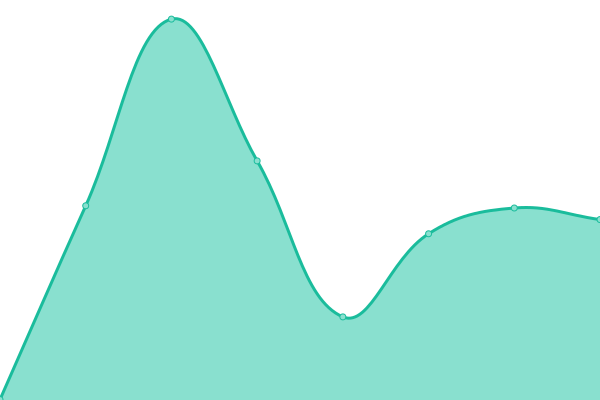

# [📈 Live Status](https://stats.wgyt.tk): <!--live status--> **🟧 Partial outage**

<!--start: status pages-->
<!-- This summary is generated by Upptime (https://github.com/upptime/upptime) -->
<!-- Do not edit this manually, your changes will be overwritten -->
<!-- prettier-ignore -->
| URL | Status | History | Response Time | Uptime |
| --- | ------ | ------- | ------------- | ------ |
|  [bot.wgyt.tk](https://bot.wgyt.tk/) | 🟩 Up | [bot-wgyt-tk.yml](https://github.com/wgyt/stats.wgyt.tk/commits/HEAD/history/bot-wgyt-tk.yml) | 

 575ms
     
 | 

<a href="https://stats.wgyt.tk/history/bot-wgyt-tk">100.00%</a>
    

|  [www.wgyt.tk](https://www.wgyt.tk/) | 🟩 Up | [www-wgyt-tk.yml](https://github.com/wgyt/stats.wgyt.tk/commits/HEAD/history/www-wgyt-tk.yml) | 

 838ms
     
 | 

<a href="https://stats.wgyt.tk/history/www-wgyt-tk">100.00%</a>
    

|  [wgyt.tk](https://wgyt.tk/) | 🟩 Up | [wgyt-tk.yml](https://github.com/wgyt/stats.wgyt.tk/commits/HEAD/history/wgyt-tk.yml) | 

 41ms
     
 | 

<a href="https://stats.wgyt.tk/history/wgyt-tk">100.00%</a>
    

|  [wgytcraft.cf](https://wgytcraft.cf/) | 🟩 Up | [wgytcraft-cf.yml](https://github.com/wgyt/stats.wgyt.tk/commits/HEAD/history/wgytcraft-cf.yml) | 

 277ms
     
 | 

<a href="https://stats.wgyt.tk/history/wgytcraft-cf">100.00%</a>
    

|  [renew](https://renew.wgytcraft.cf/) | 🟩 Up | [renew.yml](https://github.com/wgyt/stats.wgyt.tk/commits/HEAD/history/renew.yml) | 

 337ms
     
 | 

<a href="https://stats.wgyt.tk/history/renew">100.00%</a>
    

|  [www.meower.tk](https://www.meower.tk/) | 🟩 Up | [www-meower-tk.yml](https://github.com/wgyt/stats.wgyt.tk/commits/HEAD/history/www-meower-tk.yml) | 

 527ms
     
 | 

<a href="https://stats.wgyt.tk/history/www-meower-tk">100.00%</a>
    

|  [meower.tk](https://meower.tk/) | 🟩 Up | [meower-tk.yml](https://github.com/wgyt/stats.wgyt.tk/commits/HEAD/history/meower-tk.yml) | 

 320ms
     
 | 

<a href="https://stats.wgyt.tk/history/meower-tk">100.00%</a>
    

|  [meowerplus.tk](https://meowerplus.tk/) | 🟩 Up | [meowerplus-tk.yml](https://github.com/wgyt/stats.wgyt.tk/commits/HEAD/history/meowerplus-tk.yml) | 

 638ms
     
 | 

<a href="https://stats.wgyt.tk/history/meowerplus-tk">100.00%</a>
    

|  [galacticaos.tk](https://galacticaos.tk/) | 🟩 Up | [galacticaos-tk.yml](https://github.com/wgyt/stats.wgyt.tk/commits/HEAD/history/galacticaos-tk.yml) | 

 456ms
     
 | 

<a href="https://stats.wgyt.tk/history/galacticaos-tk">100.00%</a>
    

|  [search nxdomain](https://dns-node.wgyt.repl.co) | 🟥 Down | [search-nxdomain.yml](https://github.com/wgyt/stats.wgyt.tk/commits/HEAD/history/search-nxdomain.yml) | 

 0ms
     
 | 

<a href="https://stats.wgyt.tk/history/search-nxdomain">100.00%</a>
    

<!--end: status pages-->

[**Visit our status website →**](https://stats.wgyt.tk)

## 📄 License

- Powered by: [Upptime](https://github.com/upptime/upptime)
- Code: [MIT](./LICENSE) © [Upptime](https://upptime.js.org)
- Data in the `./history` directory: [Open Database License](https://opendatacommons.org/licenses/odbl/1-0/)
